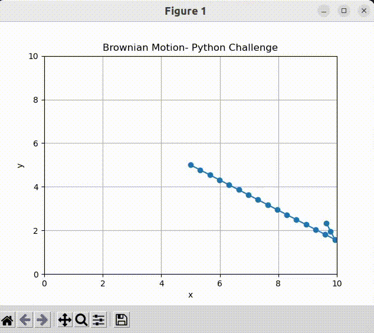

# Brownian-Motion

"Brownian-Motion" is the Python programming challenge of the JdeRobot GSoC 2024. The objective is to implement and simulate Brownian Motion-type behavior on a robot using Python 3 and standard libraries.

For more information regarding the challenge, please refer to [this](https://drive.google.com/file/d/1CidHcbfPmkdvjRxM8jUrACf8_bBN6ff2/view).

## Follow below steps to test
1. Clone this repository to your local machine.
2. Install dependencies and libraries (using pip3 install library_name).
3. Run the project by executing python3 main.py.

## Image/GIF
Result

For any queries contact me at borade.keshav825@gmail.com
